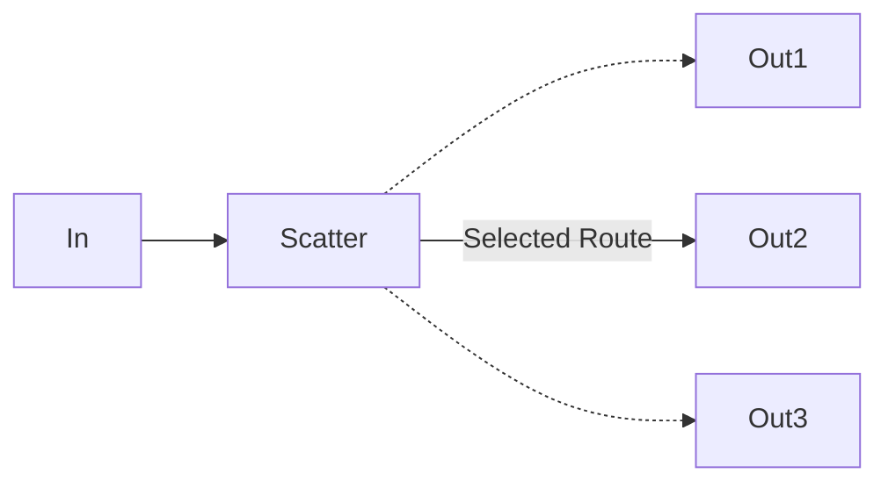

# ns-x

An easy-to-use, flexible **network simulator** library, written mainly in Go.

## Feature

* Build highly-customizable and scalable network topology upon basic nodes.
* Simulate loss, delay, etc. on any nodes by any given parameters and models.
* Collect data from each and every node in detail.
* Cross-platform.

## Introduction

#### Concept

* Network: a topological graph consist of *node*s, reflecting a real-world network for *packets* to transfer through.
* Node: a physical or logical device in the *network* allowing *packet*s to enter and leave. A *node* usually *connects*
  to other *node*s.
* Packet: simulated data packets transferring between *node*s, carrying the actual packet data with additional simulator
  information.
* Send: (*packet*s) to enter a *node*, waiting to *emit*.
* Emit: (*packet*s) to leave a *node* toward the next chained *node*.

#### Prerequisites

- `go mod` must be supported and enabled.
- A platform-specific `time/binary/*/libtime.a` library is required by cgo for high resolution timer. Its Windows,
  Linux, and Darwin binaries are pre-built. Compile the library manually if running on another arch/os. (
  See <a href = "#compile">compile</a> section)

#### Usage

Follow three steps: building network, starting network simulation, and collecting data.

##### Building network

The network is built by *node*s and *edge*s. Normally an *edge* connects only two nodes, each on one end. For special
cases a chain may have multiple node or no node on its ends.

While nodes are highly customizable, some typical nodes are pre-defined as follows:

* Broadcast: a node transfers packet from one source to multiple targets.

    ```mermaid
    graph LR
      In --> Broadcast --> Out1
      Broadcast --> Out2
      Broadcast --> Out3
    ```

* Channel: a node delays, losses or reorders packets passing by.

    ```mermaid
    graph LR
      In --> Channel -->|Loss & Delay & Reorder| Out
    ```

* Endpoint: a node only accepts incoming packets, usually acting as the end of a chain.

    ```mermaid
    graph LR
      Nodes... --> Endpoint
    ```

* Gather: a node gathers packets from multiple sources to a single target.

    ```mermaid
    graph LR
      In1 --> Gather ==> Out
      In2 --> Gather
      In3 --> Gather
    ```

* Restrict: a node limits pps or bps by dropping packets when its internal buffer overflows.

    ```mermaid
    graph LR
      In --> Restrict -->|Restricted Speed| Out
    ```

* Scatter: a node selects which node the incoming packet should be route to according to a given rule.



After all necessary *node*s created, *connect* them to build the network. To do so, just set the *next node* correctly
for each *node* to declare the *edge*.

ByteNS also provides a *builder* to facilitate the process. Instead of connecting *edge*s，it builds the network by
connecting all *path*s in one line of code.    
*Path*, aka *chain*, is similar to the *path* concept in graph theory, representing a route along the *edge*s of a
graph.

* `Chain()`: saves current chain (*path*) and in order to describe another chain.
* `Node()`: appends a given node to current chain.
* `NodeWithName()`: same as *Node*, with a customizable name to refer to later.
* `NodeByName()`: finds (refer to) a node with the given name, and appends it to current chain.
* `NodeGroup()`: given some nodes, perform *Node* operation on each of them in order.
* `NodeGroupWithName()`: same as *NodeGroup*, with a customizable name.
* `NodeGroupByName()`: finds a group with the given name, then perform *NodeGroup* operation on it.
* `Build()`: actually connect the previously described *chain*s to finally build the network. Note that connections of
  nodes outside the builder will be overwritten

##### Starting Network Simulation

Once the network is built, start running it so packets can be sent into any entry nodes and received from any *
endpoint* (exit) nodes.

##### Collecting Data

Data could be collected by callback function `node.OnEmitCallback()`. Also note that time-costing callbacks would slow
down the simulation and lead to error of result, so it is highly recommended only collecting data in the callbacks.
Further analyses should be done after the simulation.

#### Example

Following is an example of a network with two entries, one endpoint and two chains.

* Chain 1: entry1 -> channel1(with `30%` packet loss rate) -> restrict (1 pps, 1024 bps, buffer limited in 4096 bytes
  and 5 packets) -> endpoint
* Chain 2: entry2 -> channel2(with `10%` packet loss rate) -> endpoint

```go
package main

import (
	"byte-ns"
	"byte-ns/base"
	"byte-ns/math"
	"byte-ns/node"
	"math/rand"
)

func main() {
	source := rand.NewSource(0)
	random := rand.New(source)

	// design a callback function to collect data
	callback := func(packet *base.SimulatedPacket) {
		println("emit packet")
		println(packet.String())
	}

	// build the network with the builder
	helper := byte_ns.NewBuilder()
	n1 := node.NewChannelNode("entry1", 0, callback, math.NewRandomLoss(0.1, random))
	network, nodes := helper.
		Chain().
		Node(n1).
		Node(node.NewRestrictNode("", 0, nil, 1.0, 1024.0, 8192, 20)).
		Node(node.NewEndpointNode("endpoint")).
		Chain().
		Node(node.NewChannelNode("entry2", 0, callback, math.NewRandomLoss(0.1, random))).
		NodeByName("endpoint").
		Build(1, 10000, 10)

	// start network simulation
	network.Start()
	defer network.Stop()

	// locate entry and exit(?) nodes
	entry1 := nodes["entry1"]
	entry2 := nodes["entry2"]
	endpoint := nodes["endpoint"].(*node.EndpointNode)

	// send and receive through the network simulator
	for i := 0; i < 20; i++ {
		entry1.Send(&base.Packet{Data: []byte{0x01, 0x02}})
	}
	for i := 0; i < 20; i++ {
		entry2.Send(&base.Packet{Data: []byte{0x01, 0x02}})
	}
	count := 0
	for {
		packet := endpoint.Receive()
		if packet != nil {
			count++
			println("receive packet")
			println(packet.String())
			println("total", count, "packets received")
		}
	}
}
```

#### Compile from source code<span id="compile"/>

The following library is built successfully on Go v1.16.5, cmake v3.21.0, clang v12.0.5, with C++ 11.

```bash
cd time/cpp
cmake CMakeLists.txt
make
```

which generates file `libtime.a` under `time/cpp` directory.

To make the compiled library work, a tag *time_compiled* need to be added to go build.

```bash
go build -tags time_compiled
```

There is also a configuration file `cross-compile.cmake` for cross compiling the high resolution time library with
little modification.

## Design

#### Architecture

Each node has a packet buffer, once a packet is sent to the node, it will be put in the buffer. The buffer itself is
implemented thread-safe and lock-free for high performance.

There is a global main loop host by the network, which clears each node's buffer and decide when to emit packets.

#### Main Loop

The main loop maintains a thread-local heap, in order to sort the packets.

The loop is separated into two parts: fetch and drain.

* fetch: The main loop clear the packet buffer of all the nodes, and put these packets into the heap.
* drain: The main loop drain the heap until the heap only contains packets with emit time after the current time.

~~By now, the main loop lock a single os thread, but in the future, the main loop may run on a fork join pool.~~

Parallelized main loop is already implemented, main loop will split once the packet heap reach a given threshold, and
exit after spinning a fixed rounds without any task. The active main loop will always exist but no more than a given
limit.

#### High Resolution Time

Time is of vital significance in simulations, it directly decides the accuracy of simulation.

Since the simulation needs to access current time with high resolution and low cost, the standard time library of go is
not enough. (internal system call, accurate but with high cost, update not timely)

Currently, high resolution time is a wrapper of C++ time library. The core design is use system time and steady time
together. The system time means time retrieved through system call, while the steady time is usually a counter of CPU
cycles. The system time is accurate but with lower resolution and higher cost, the steady time is not so accurate (due
to turbo of CPU) but with the highest resolution in theory. Once trying to fetch the time, it's checked whether enough
time has passed by since the last alignment. If so, an alignment will be performed immediately. The align operation
itself is thread safe by a lock, but another double check will guarantee low cost.

## Contribution

#### Future work

* ~~parallelize main loop~~ (done)
* implement commonly used protocol stack as a new node type
* separate send and pass to avoid cumulative error
