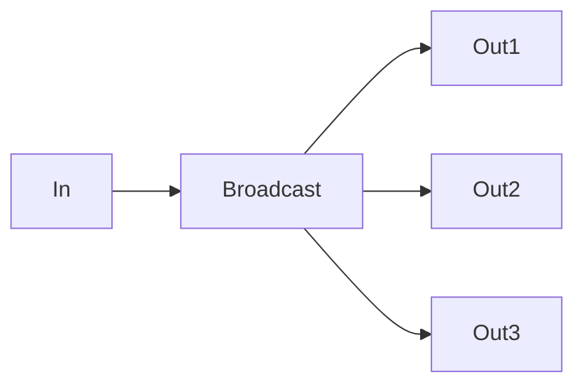
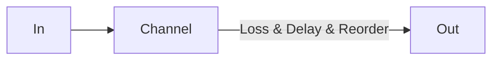
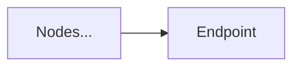
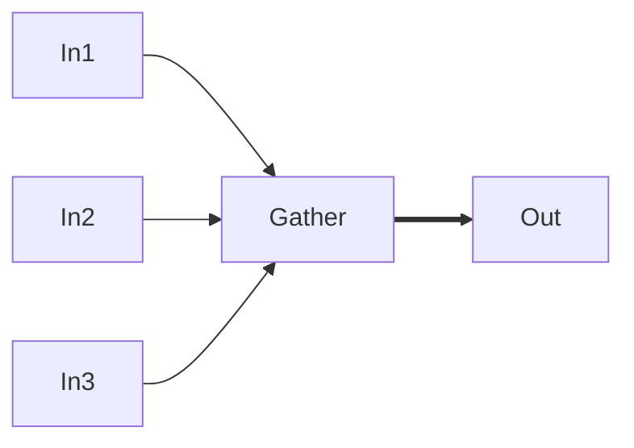
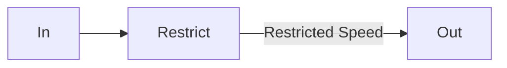
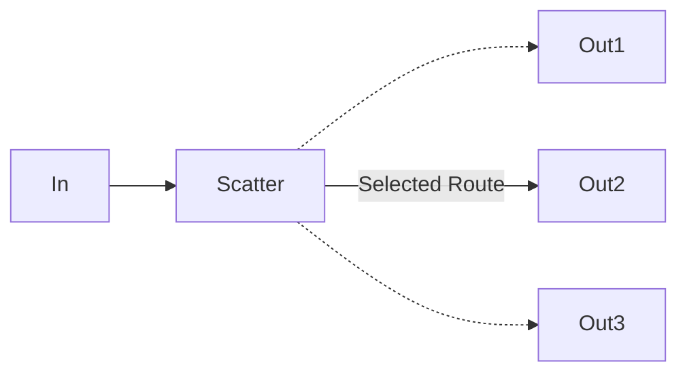

# ns-x

[](https://github.com/bytedance/ns-x/actions/workflows/go.yml)
[](https://github.com/bytedance/ns-x/actions/workflows/codeql.yml)

An easy-to-use, flexible **network simulator** library for Go.

## Feature

* Programmatically build customizable and scalable network topology from basic nodes.
* Simulate packet loss, delay, etc. on any nodes, according to any parameters inputs in well-defined models.
* Collect network and user-defined data in detail, from each and every node.
* Cross-platform. High precision.

## Introduction

#### Concept

* **Network**: a topological graph consist of **node**s, reflecting a real-world network for **packet** to transfer and route through.
* **Node**: a physical or logical device in the **network** deciding what to do when a **packet** going through. A **node** usually **connect** to other **node**s.
* **Event**: an action to be done at a given time point.
* **Packet**: simulated data **packet**s **transfer**ring between **node**s.
* **Transfer**: the behavior of **node** when a **packet** going through.

#### Prerequisites

- `go mod` must be supported and enabled.

#### Usage

Use in three steps: building network, starting network simulation, and collecting data.

##### 1. Building network

The network is built by nodes and edges. Normally an edge connects only two nodes, each on one end. In some special cases, a node may connect to multiple (or none) incoming and/or outgoing nodes.

While nodes are highly customizable, some typical nodes are pre-defined as follows:

<!-- note that mermaid compilation of GitHub action only supports code blocks with no indents -->

* Broadcast: a node transfers packet from one source to multiple targets.

<!-- generated by mermaid compile action - START -->

<details>
  <summary>Mermaid markup</summary>



</details>
<!-- generated by mermaid compile action - END -->

* Channel: a node delays, losses or reorders packets passing by.

<!-- generated by mermaid compile action - START -->

<details>
  <summary>Mermaid markup</summary>



</details>
<!-- generated by mermaid compile action - END -->

* Endpoint: a node where to send and receive packets, usually acting as the endpoint of a chain.

<!-- generated by mermaid compile action - START -->

<details>
  <summary>Mermaid markup</summary>



</details>
<!-- generated by mermaid compile action - END -->

* Gather: a node gathers packets from multiple sources to a single target.

<!-- generated by mermaid compile action - START -->

<details>
  <summary>Mermaid markup</summary>



</details>
<!-- generated by mermaid compile action - END -->

* Restrict: a node limits pps or bps by dropping packets when its internal buffer overflows.

<!-- generated by mermaid compile action - START -->

<details>
  <summary>Mermaid markup</summary>



</details>
<!-- generated by mermaid compile action - END -->

* Scatter: a node selects which node the incoming packet should be route to according to a given rule.

<!-- generated by mermaid compile action - START -->

<details>
  <summary>Mermaid markup</summary>



</details>
<!-- generated by mermaid compile action - END -->


After all necessary nodes created, connect them with code to build the network. To do so, just set the next node correctly for each node until all edges are defined as expected.

In addition, ns-x provides a builder to facilitate the process. Instead of connecting edges, it builds the network by connecting all paths in one line of code.

A Path, *aka.* a chain, is similar to the path concept in graph theory, representing a route along the edges of a graph.

Methods of the builder:

* `Chain()`: saves current chain (path) and start to describe another chain.
* `Node()`: appends a given node to current chain.
* `NodeWithName()`: same as `Node()`, with a customizable name to refer to later.
* `NodeByName()`: finds (refer to) a node with given name and appends it to current chain.
* `NodeGroup()`: given a number of nodes, perform `Node()` operation on each of them in order.
* `NodeGroupWithName()`: same as `NodeGroup()` with a customizable name.
* `NodeGroupByName()`: finds a group with the given name, then perform `NodeGroup()` operation on it.
* `Build()`: is the final trigger of the builder to really build the network. Note that in all nodes used in this builder line, all previously established connections will be overwritten.

##### 2. Starting Network Simulation

Once the network built, start running it so packets can go through nodes.

**Guaranteed behaviours of the simulation**

* Order: if any event e at time point *t*, only generate events at time point not before *t*, then the handling order of two events at different time point is guaranteed, and the order of events at same time point is undetermined.
* Accuracy: each event will be handled at the given time point exactly in simulate clock, and the difference between the simulator clock and real clock is as small as possible, usually some microseconds.

See comments in the code for additional node-specific guarantees.

##### 3. Collecting Data

Data could be collected by callback function `node.OnTransferCallback()`. Also note that time-costing callbacks would slow down the simulation and lead to inaccuracy, so it is highly recommended only collecting data in the callbacks. Further analyses should be done after the simulation.

#### Example

##### 1. Basic Example

Source code of this example can be found at main/basic.go

Following is a basic example to show how to use the simulator, it's about a network with two entries, one endpoint and two chains.

* Chain 1: entry1 -> channel1(with `30% packet loss rate`) -> restrict (`1 pps`, `1024 bps`, buffer limited to `4096 bytes` and `5 packets`) -> endpoint
* Chain 2: entry2 -> channel2(with `10% packet loss rate`) -> endpoint

<details>
<summary>code of the basic example</summary>

```go
package main

// Example of how to use the simulator basically

import (
	"github.com/bytedance/ns-x/v2"
	"github.com/bytedance/ns-x/v2/base"
	"github.com/bytedance/ns-x/v2/math"
	"github.com/bytedance/ns-x/v2/node"
	"github.com/bytedance/ns-x/v2/tick"
	"go.uber.org/atomic"
	"math/rand"
	"time"
)

func basic() {
	source := rand.NewSource(0)
	random := rand.New(source)
	helper := ns_x.NewBuilder()
	callback := func(packet base.Packet, source, target base.Node, now time.Time) {
		println("emit packet")
	}
	n1 := node.NewEndpointNode()
	t := time.Now()
	network, nodes := helper.
		Chain().
		NodeWithName("entry1", n1).
		Node(node.NewChannelNode(node.WithTransferCallback(callback), node.WithLoss(math.NewRandomLoss(0.1, random)))).
		Node(node.NewRestrictNode(node.WithPPSLimit(1, 20))).
		NodeWithName("endpoint", node.NewEndpointNode()).
		Chain().
		NodeWithName("entry2", node.NewEndpointNode()).
		Node(node.NewChannelNode(node.WithTransferCallback(callback), node.WithLoss(math.NewRandomLoss(0.1, random)))).
		NodeOfName("endpoint").
		Summary().
		Build()
	entry1 := nodes["entry1"].(*node.EndpointNode)
	entry2 := nodes["entry2"].(*node.EndpointNode)
	endpoint := nodes["endpoint"].(*node.EndpointNode)
	count := atomic.NewInt64(0)
	endpoint.Receive(func(packet base.Packet, now time.Time) []base.Event {
		if packet != nil {
			count.Inc()
			println("receive packet at", now.String())
			println("total", count.Load(), "packets received")
		}
		return nil
	})
	total := 20
	events := make([]base.Event, 0, total*2)
	for i := 0; i < 20; i++ {
		events = append(events, entry1.Send(base.RawPacket([]byte{0x01, 0x02}), t))
	}
	for i := 0; i < 20; i++ {
		events = append(events, entry2.Send(base.RawPacket([]byte{0x01, 0x02}), t))
	}
	event := base.NewPeriodicEvent(func(now time.Time) []base.Event {
		for i := 0; i < 10; i++ {
			_ = rand.Int()
		}
		return nil
	}, time.Second, t)
	events = append(events, event)
	network.Run(events, tick.NewStepClock(t, time.Second), 300*time.Second)
	defer network.Wait()
}
```

</details>

##### 2. Echo Example

Source code of this example can be found at main/echo.go

Following is an example to show how to define a duplex network and set up an echo service, it's about an.

<details>
<summary>code of the echo example</summary>

```go
package main

// Example of a duplex network, where to endpoints echo to each other

import (
	"github.com/bytedance/ns-x/v2"
	"github.com/bytedance/ns-x/v2/base"
	"github.com/bytedance/ns-x/v2/math"
	"github.com/bytedance/ns-x/v2/node"
	"github.com/bytedance/ns-x/v2/tick"
	"time"
)

func echo() {
	now := time.Now()
	helper := ns_x.NewBuilder()
	network, nodes := helper.
		Chain().
		NodeWithName("restrict 1", node.NewRestrictNode(node.WithBPSLimit(1024*1024, 4*1024*1024))).
		NodeWithName("channel 1", node.NewChannelNode(node.WithDelay(math.NewFixedDelay(150*time.Millisecond)))).
		Chain().
		NodeWithName("restrict 2", node.NewRestrictNode(node.WithPPSLimit(10, 50))).
		NodeWithName("channel 2", node.NewChannelNode(node.WithDelay(math.NewFixedDelay(200*time.Millisecond)))).
		Chain().
		NodeWithName("endpoint 1", node.NewEndpointNode()).
		Group("restrict 1", "channel 1").
		NodeWithName("endpoint 2", node.NewEndpointNode()).
		Chain().
		NodeOfName("endpoint 2").
		Group("restrict 2", "channel 2").
		NodeOfName("endpoint 1").
		Summary().
		Build()
	endpoint1 := nodes["endpoint 1"].(*node.EndpointNode)
	endpoint2 := nodes["endpoint 2"].(*node.EndpointNode)
	endpoint1.Receive(func(packet base.Packet, now time.Time) []base.Event {
		println("endpoint 1 receive:", string(packet.(base.RawPacket)), "at", now.String())
		return base.Aggregate(endpoint1.Send(packet, now))
	})
	endpoint2.Receive(func(packet base.Packet, now time.Time) []base.Event {
		println("endpoint 2 receive:", string(packet.(base.RawPacket)), "at", now.String())
		return base.Aggregate(endpoint2.Send(packet, now))
	})
	network.Run([]base.Event{endpoint1.Send(base.RawPacket("hello world"), now)}, tick.NewStepClock(now, time.Second), 30*time.Second)
	defer network.Wait()
}
```

</details>

##### 3. Route Example

Source code of this example can be found at main/route.go

Following is an advanced example to show how to customize route rules of the network.

Suppose we have 1 client and 2 servers, route from client to server 1 has 200ms delay and no loss, route from client to server 2 has 300ms delay and no loss.

We assign ip address "192.168.0.1" to server 1, "192.168.0.2" to server 2, ports are not used in this example, but obviously route rules based on ip+port is similar to which based on ip.

This example only shows how to define route rules of a simplex network for simplicity, but it's easy to define route rules for duplex network.

<details>
<summary>code of the route example</summary>

```go
package main

// Example of how to customize route rule

import (
	"github.com/bytedance/ns-x/v2"
	"github.com/bytedance/ns-x/v2/base"
	"github.com/bytedance/ns-x/v2/math"
	"github.com/bytedance/ns-x/v2/node"
	"github.com/bytedance/ns-x/v2/tick"
	"time"
)

func route() {
	helper := ns_x.NewBuilder()
	t := time.Now()
	routeTable := make(map[base.Node]base.Node)
	ipTable := make(map[string]base.Node)
	scatter := node.NewScatterNode(node.WithRouteSelector(func(packet base.Packet, nodes []base.Node) base.Node {
		if p, ok := packet.(*packetWithNode); ok {
			return routeTable[p.destination]
		}
		panic("no route to host")
	}))
	client := node.NewEndpointNode()
	network, nodes := helper.
		Chain().
		Node(client).
		Node(scatter).
		NodeWithName("route1", node.NewChannelNode(node.WithDelay(math.NewFixedDelay(time.Millisecond*200)))).
		NodeWithName("server1", node.NewEndpointNode()).
		Chain().
		Node(client).
		Node(scatter).
		NodeWithName("route2", node.NewChannelNode(node.WithDelay(math.NewFixedDelay(time.Millisecond*300)))).
		NodeWithName("server2", node.NewEndpointNode()).
		Build()
	server1 := nodes["server1"].(*node.EndpointNode)
	server2 := nodes["server2"].(*node.EndpointNode)
	route1 := nodes["route1"]
	route2 := nodes["route2"]
	routeTable[server1] = route1
	routeTable[server2] = route2
	ipTable["192.168.0.1"] = server1
	ipTable["192.168.0.2"] = server2
	server1.Receive(react1) // server 1 should receive after 1-second send delay + 200 milliseconds channel delay
	server2.Receive(react2) // server 2 should receive after 2-second send delay + 200 milliseconds channel delay
	sender := createSender(client, ipTable)
	events := make([]base.Event, 0)
	events = append(events, sender(base.RawPacket([]byte{}), "192.168.0.1", t.Add(time.Second*1))) // send to server1 after 1 second
	events = append(events, sender(base.RawPacket([]byte{}), "192.168.0.2", t.Add(time.Second*2))) // send to server2 after 2 second
	network.Run(events, tick.NewStepClock(t, time.Millisecond), 300*time.Second)
	defer network.Wait()
}

func react1(packet base.Packet, now time.Time) []base.Event {
	println("server 1 receive at", now.String())
	return nil
}

func react2(packet base.Packet, now time.Time) []base.Event {
	println("server 2 receive at", now.String())
	return nil
}

type packetWithNode struct {
	base.Packet
	source, destination base.Node
}

type sender func(packet base.Packet, ip string, t time.Time) base.Event

func createSender(client *node.EndpointNode, ipTable map[string]base.Node) sender {
	return func(packet base.Packet, ip string, t time.Time) base.Event {
		return client.Send(&packetWithNode{packet, client, ipTable[ip]}, t)
	}
}
```

</details>

## Design

#### Architecture

The simulator is event driven, each event will be handled at the given time point, and generate subsequent events. Behaviors of nodes will be wrapped as events.

#### Event Loop

The event loop maintains a thread-local event queue, in order to sort the events.

Basic operation is dequeue an event from the queue, handle it and enqueue events generated each time. The event loop will drain the event queue until only events with time point after current time are left.

Once the event queue is drained, event loop will refresh current time from the clock, and redo operations above until no events left in the queue or reach lifetime of the simulation.

#### Event Queue

The event queue is used to sort events to guarantee the handling order.

As observed, most of the events generated just with a short delay, which form an events cluster. For events cluster, bucket sort is used first to divide events into some buckets; other events are put into another bucket.

For each bucket, a heap sort is used to form the priority queue.

Since buckets are created/destroyed frequently, but total count of buckets at the same time are usually within a bound. All the buckets are stored in a ring queue, to reduce the cost and avoid gc.

## Contribution

#### Future work

* ~~parallelize main loop~~ (done)
* ~~implement commonly used protocol stack as a new node type~~ (will be implemented as different packet type)
* ~~separate send and pass to avoid cumulative error~~ (done)
* ~~Buffer overflow determination of *restrict node* should have a more accurate way~~ (done)
* ~~split event heap when size of heap is large enough~~ (done)
* implement packets of commonly used protocol

#### Contributors

<a href="https://github.com/bytedance/ns-x/graphs/contributors">
    
</a>

Made with [contributors-img](https://contrib.rocks).
